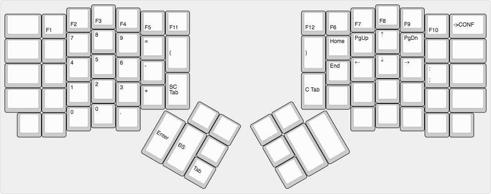

# ErgoDox EZ Test Configuration

## Changelog

* Nov 29, 2016:
  * Created Initially.

The image says it all:

To update keymap...

$ cd qmk_firmware/keyboards/ergodox
$ make clean keymap=schwalski; and make keymap=schwalski
$ make teensy keymap=schwalski
<RESET ergodox>
